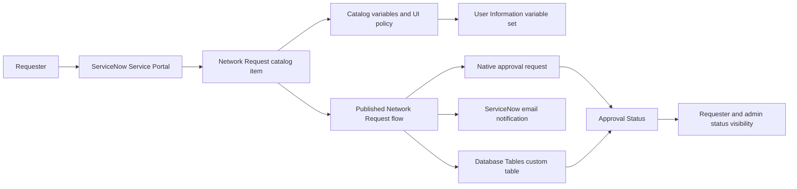
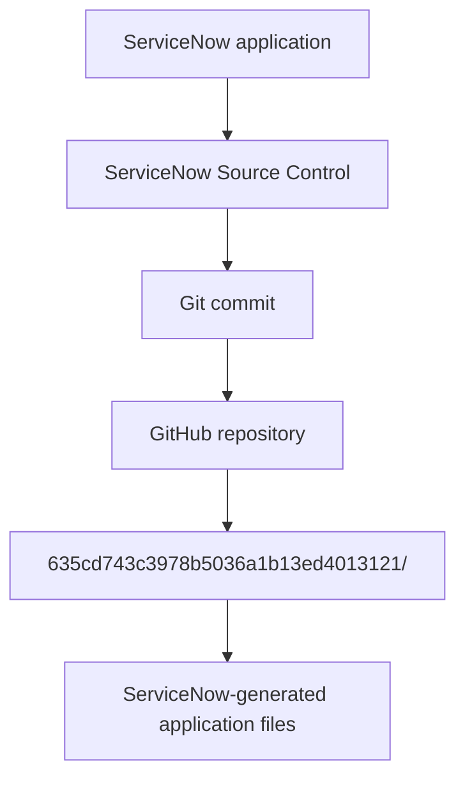

# Automated Network Request Management in ServiceNow

A configuration-first ServiceNow capstone project for submitting, processing, notifying, approving, and tracking network-related service requests.

> This repository is a source-controlled project representation and evidence package. It is not a running ServiceNow instance. Cloning or downloading it does not create a working ServiceNow environment by itself.

## Quick Summary

The project addresses a fragmented network-service request process in which information can be collected inconsistently, approvals can be coordinated separately, and request status can be difficult to track. The documented solution uses native ServiceNow configuration to provide:

- A Service Portal `Network Request` catalog item.
- Catalog variables with mandatory-field validation.
- A conditional `Enter your Existing ID` field for existing connections.
- A `User Information` variable set associated with the catalog item.
- A custom `Database Tables` table in the scoped application.
- A published Flow Designer flow named `Network Request`.
- Email notification, native approval handling, and final `Approved` or `Rejected` status updates.
- A related approval request and access controls for the custom table.

The implementation documentation states that the project uses native ServiceNow capabilities without custom Script Includes, Business Rules, or external integrations.

## Project Identity

| Item | Repository evidence |
| --- | --- |
| Project title | Automated Network Request Management in ServiceNow |
| ServiceNow application | Automated Network Request Management |
| Application scope | `x_2079691_automa_0` |
| Application source ID | `635cd743c3978b5036a1b13ed4013121` |
| Application version in the exported record | `1.0.0` |
| Application short description | ServiceNow Capstone Project |
| Catalog item | Network Request |
| Backend table | Database Tables (`x_2079691_automa_0_database_tables`) |
| Flow | Network Request, published, Service Catalog trigger |
| Demonstration | `7. Project Demonstration/ServiceNow Project Demo - Detailed.mp4` |

## What Is Implemented

The repository documents and source-controls the following implemented behavior:

1. A requester opens the `Network Request` catalog item through the Service Portal.
2. The form captures requester, connection, payment, amount, and address information.
3. Mandatory validation applies to Mobile Number, Type of Connection, Total Amount, Mode of Payment, and Address.
4. Type of Connection provides `New` and `Existing` choices. The exported catalog variable defaults to `new`.
5. The catalog UI policy `Show Existing ID for Existing Connection` applies when the connection value is `existing`; its reverse behavior hides the field otherwise.
6. The `User Information` variable set is attached to the catalog item. The documentation describes auto-population of requester email, user name, and phone number after `Opened on behalf of` is selected.
7. The Service Catalog-triggered Flow Designer flow gets the submitted catalog values and creates a record in the custom `Database Tables` table.
8. The backend record has an auto-generated Database Number and an initial Approval Status of `Requested`, as described in the testing and requirements documents.
9. The flow sends an email notification and creates an approval request using ServiceNow's native approval mechanism.
10. The approval outcome updates the backend Approval Status to `Approved` or `Rejected`.
11. The `Approval Request` relationship exposes the linked approval record, and the exported source includes ACLs and roles for the custom table.

The architecture documents describe the approval configuration as an `Anyone approves` rule with a single approver used during testing. They explicitly distinguish this from a multi-level manager or security hierarchy.

## Architecture



The diagrams and project documents describe the Service Portal, catalog configuration, Flow Designer, native approval engine, custom table, notification, and status tracking as ServiceNow-native components. They do not describe network-device provisioning, Cisco integration, Ansible integration, or an external API.

## How ServiceNow Source Control Works in This Repository

The repository stores the ServiceNow application's source-controlled representation generated by ServiceNow. It does not store a running instance or a complete copy of the ServiceNow platform.



The relationship is:

```text
sn_source_control.properties
        |
        +-- path=635cd743c3978b5036a1b13ed4013121
                |
                +-- 635cd743c3978b5036a1b13ed4013121/
                        |
                        +-- ServiceNow application source-control files
```

`sn_source_control.properties` contains the path to the application content in this repository. It does not contain the entire application itself. Its exact value is:

```properties
path=635cd743c3978b5036a1b13ed4013121
```

Accordingly, the directory named `635cd743c3978b5036a1b13ed4013121/` is the location of the ServiceNow-generated application files. GitHub stores that source-controlled representation; a ServiceNow PDI is the runtime environment in which the application can be connected, imported, and tested subject to the release, instance configuration, permissions, and source-control setup.

## ServiceNow Source-Controlled Application

The application directory is `635cd743c3978b5036a1b13ed4013121/`. It contains 68 XML records plus a ServiceNow-generated README and checksum file.

### `sys_app_635cd743c3978b5036a1b13ed4013121.xml`

This is the exported `sys_app` record for the application. The file identifies:

- Name: `Automated Network Request Management`
- Scope and source: `x_2079691_automa_0`
- Application sys_id: `635cd743c3978b5036a1b13ed4013121`
- Version: `1.0.0`
- Active and trackable state
- Short description: `ServiceNow Capstone Project`

It is application metadata, not a standalone executable application package.

### `dictionary/`

`dictionary/x_2079691_automa_0_database_tables.xml` is the application table dictionary record for `x_2079691_automa_0_database_tables`, labelled `Database Tables`. It identifies the custom table represented by the exported application content.

### `update/`

The `update/` directory contains the exported configuration records observed in this repository, including:

- The `Network Request` Service Catalog item and its catalog/category associations.
- Eleven catalog variable records, including Requested For, Mobile Number, User Name, Email ID, Phone Number, Type of Connection, Existing ID, Total Amount, Mode of Payment, and Address.
- Four question-choice records: New, Existing, UPI, and CARD.
- The `User Information` variable-set association.
- The `Show Existing ID for Existing Connection` catalog UI policy.
- The `Database Tables` custom table, dictionary fields, field documentation, number configuration, UI application/module, view, and form section.
- The published `Network Request` Flow Designer record and its stored flow configuration.
- The `Approval Request` relationship.
- Record ACLs and ACL-role associations for create, read, write, and delete operations on the custom table.
- Application roles, embedded help-role records, and related UI records.

This is the set of configuration record types evidenced by the files; it is not a claim that every possible ServiceNow record type is present.

### `author_elective_update/`

`author_elective_update/sys_dictionary_x_2079691_automa_0_database_tables_u_string_1.xml` is a dictionary update record for the `u_string_1` field. Its exported action is `DELETE`, and the record is labelled `Database Number`. This is ServiceNow-generated update content and should be interpreted with the rest of the application export rather than as a separate application feature.

### `checksum.txt`

This file contains the checksum value generated with the ServiceNow source-control content. The generated application README explains that checksum mismatches or commits containing non-ServiceNow-generated changes can affect repository import/recovery procedures. The checksum is metadata for the export; it is not the application data model by itself.

### The generated application `README.md`

The README inside the application directory is ServiceNow-generated guidance about generated files, checksum mismatches, and recovery using Git history. It is separate from this root README and should be read when diagnosing source-control import or checksum issues.

## Data and Request Configuration

The source and documentation identify the following custom table fields:

| Field label | Exported element/type |
| --- | --- |
| Database Number | `number`, string dictionary field with number configuration |
| Assignment to | `u_reference_2`, reference to `sys_user` |
| Mobile Number | `u_string_3`, string |
| Total Amount | `u_string_4`, string |
| Mode of Payment | `u_string_5`, string |
| Type of Connection | `u_string_6`, string |
| Customer Address | `u_string_7`, string |
| Approval Status | `u_string_8`, string |
| Requested For | `u_string_9`, string |

The catalog configuration also contains the requester and request-entry variables listed in the source-control section. The project documents describe the catalog values as being mapped to the backend record. The repository does not provide a general-purpose database schema outside these ServiceNow-generated records.

## Documentation Guide

The documentation is organized as a project lifecycle. Each deliverable is available in both editable DOCX and PDF form unless stated otherwise.

### 1. Ideation Phase

Purpose: establish the user problem, explore candidate ideas, and prioritize what could be implemented in the project timeframe.

| Files | Purpose and reviewer value |
| --- | --- |
| [Brainstorming_Idea_Prioritization_Network_Request.docx](1.%20Ideation%20Phase/Brainstorming_Idea_Prioritization_Network_Request.docx) and [PDF](1.%20Ideation%20Phase/Brainstorming_Idea_Prioritization_Network_Request.pdf) | Shows the brainstorming process, grouping into request/UI, backend data, automation/approval, and notification/tracking themes, and the importance-versus-feasibility prioritization. It separates implemented scope from future enhancements. |
| [Define_Problem_Statements_Network_Request.docx](1.%20Ideation%20Phase/Define_Problem_Statements_Network_Request.docx) and [PDF](1.%20Ideation%20Phase/Define_Problem_Statements_Network_Request.pdf) | Defines PS-1, manual/inconsistent request submission, and PS-2, lack of approval visibility. It records the requester situation, goal, obstacle, cause, and resulting feeling, then summarizes the problem, need, and solution. |
| [Empathy_Map_Canvas_Network_Request.docx](1.%20Ideation%20Phase/Empathy_Map_Canvas_Network_Request.docx) and [PDF](1.%20Ideation%20Phase/Empathy_Map_Canvas_Network_Request.pdf) | Models the employee/requester persona, including the pains and gains that informed the request workflow. The document notes that this is an ideation artifact, not a separate formal user-research study. |

### 2. Requirement Analysis

Purpose: translate the problem into user journeys, data movement, user stories, functional requirements, and a technology description.

| Files | Purpose and reviewer value |
| --- | --- |
| [Customer_Journey_Map_Network_Request.docx](2.%20Requirement%20Analysis/Customer_Journey_Map_Network_Request.docx) and [PDF](2.%20Requirement%20Analysis/Customer_Journey_Map_Network_Request.pdf) | Traces the requester journey through discovering, submitting, and tracking a request across the documented phases Entice, Enter, Engage, Exit, and Extend. It identifies pain points and realistic opportunities. |
| [Data_Flow_Diagram_User_Stories_Network_Request.docx](2.%20Requirement%20Analysis/Data_Flow_Diagram_User_Stories_Network_Request.docx) and [PDF](2.%20Requirement%20Analysis/Data_Flow_Diagram_User_Stories_Network_Request.pdf) | Provides context-level and detailed data-flow views and user stories for the requester, approver, and ServiceNow admin. The stories cover submission, validation, dynamic form behavior, auto-population, record creation, notification, approval, traceability, security, and troubleshooting. |
| [Solution_Requirements_Network_Request.docx](2.%20Requirement%20Analysis/Solution_Requirements_Network_Request.docx) and [PDF](2.%20Requirement%20Analysis/Solution_Requirements_Network_Request.pdf) | Lists the functional requirements for submission, dynamic form behavior, requester auto-population, backend record creation, email notification, and approval workflow, plus the documented non-functional requirements. |
| [Technology_Stack_Network_Request.docx](2.%20Requirement%20Analysis/Technology_Stack_Network_Request.docx) and [PDF](2.%20Requirement%20Analysis/Technology_Stack_Network_Request.pdf) | Maps the implemented components to ServiceNow Service Portal, Catalog Variables, Catalog UI Policy, User Information Variable Set, Flow Designer, native approval handling, the custom table, and the ServiceNow instance data store. |

### 3. Project Design Phase

Purpose: explain why the selected ServiceNow-native design fits the stated problem and how the components work together.

| Files | Purpose and reviewer value |
| --- | --- |
| [Problem_Solution_Fit_Template_Network_Request_ServiceNow.docx](3.%20Project%20Design%20Phase/Problem%20-%20Solution%20Fit%20Template/Problem_Solution_Fit_Template_Network_Request_ServiceNow.docx) and [PDF](3.%20Project%20Design%20Phase/Problem%20-%20Solution%20Fit%20Template/Problem_Solution_Fit_Template_Network_Request_ServiceNow.pdf) | Completed problem-solution-fit canvas for the Network Request project. It documents the customer/problem context and the fit of the proposed solution. |
| [Proposed_Solution_Network_Request.docx](3.%20Project%20Design%20Phase/Proposed%20Solution/Proposed_Solution_Network_Request.docx) and [PDF](3.%20Project%20Design%20Phase/Proposed%20Solution/Proposed_Solution_Network_Request.pdf) | Describes the problem, the proposed Service Portal catalog item, validation, conditional Existing ID field, requester auto-population, backend record creation, email, approval, status update, and the configuration-first/no-custom-scripting design. |
| [Solution_Architecture_Network_Request.docx](3.%20Project%20Design%20Phase/Solution%20Architecture/Solution_Architecture_Network_Request.docx) and [PDF](3.%20Project%20Design%20Phase/Solution%20Architecture/Solution_Architecture_Network_Request.pdf) | Provides the architecture and data flow from requester/approver through Service Portal, catalog configuration, Flow Designer, the custom table, native approval engine, notification, and final status. It explicitly records the single-approver testing configuration. |

### 4. Project Planning Phase

Purpose: show the product backlog, sprint sequence, story points, priorities, and delivery plan.

| Files | Purpose and reviewer value |
| --- | --- |
| [Project_Planning_Network_Request.docx](4.%20Project%20Planning%20Phase/Project_Planning_Network_Request.docx) and [PDF](4.%20Project%20Planning%20Phase/Project_Planning_Network_Request.pdf) | Lists the fourteen documented user stories across two sprints, including submission, validation, dynamic behavior, auto-population, backend configuration, notification, status tracking, approval, security/access, and troubleshooting. |

### 5. Project Development Phase

Purpose: provide performance-model evidence, UAT scope, execution results, and defect resolution.

#### Performance Testing

| Files | Purpose and reviewer value |
| --- | --- |
| [Model_Performance_Test_Network_Request_ServiceNow.docx](5.%20Project%20Development%20Phase/Performance%20Testing/Model_Performance_Test_Network_Request_ServiceNow.docx) and [PDF](5.%20Project%20Development%20Phase/Performance%20Testing/Model_Performance_Test_Network_Request_ServiceNow.pdf) | Summarizes the ServiceNow automation model and reports a 100% functional pass rate: 19 of 19 UAT cases passed. It records the approved and rejected workflow outcomes and correctly notes that this is a rule-based workflow, not an ML/YOLO model. |
| [User_Acceptance_Testing_UAT_Network_Request_ServiceNow.docx](5.%20Project%20Development%20Phase/Performance%20Testing/User_Acceptance_Testing_UAT_Network_Request_ServiceNow.docx) and [PDF](5.%20Project%20Development%20Phase/Performance%20Testing/User_Acceptance_Testing_UAT_Network_Request_ServiceNow.pdf) | Defines the UAT scope for the catalog item, variables, UI policy, variable set, Flow Designer, custom table, email log, approval relationship, status conditions, and ACLs. It references test cases TC-001 through TC-019. |

#### User Acceptance Testing

| Files | Purpose and reviewer value |
| --- | --- |
| [UAT_Execution_Report_Network_Request_ServiceNow.docx](5.%20Project%20Development%20Phase/User%20Acceptance%20Testing/UAT_Execution_Report_Network_Request_ServiceNow.docx) and [PDF](5.%20Project%20Development%20Phase/User%20Acceptance%20Testing/UAT_Execution_Report_Network_Request_ServiceNow.pdf) | Reports 19 executed and passed test cases, no open defects, and one fixed Severity 2 defect. The defect was that the catalog item was not associated with the flow; linking the correct Network Request flow resolved it and was verified by TC-009 and TC-019. |

### 6. Project Documentation

Purpose: provide the consolidated project report.

| Files | Purpose and reviewer value |
| --- | --- |
| [Final_Report_Network_Request.docx](6.%20Project%20Documentation/Final_Report_Network_Request.docx) and [PDF](6.%20Project%20Documentation/Final_Report_Network_Request.pdf) | Consolidates the project overview, purpose, problem statements, design, implementation, architecture, testing, and project evidence. It is the best single document for a complete project narrative after reviewing the lifecycle folders. |

### 7. Project Demonstration

Purpose: provide the visual demonstration submitted with the project.

| File | Purpose and reviewer value |
| --- | --- |
| [ServiceNow Project Demo - Detailed.mp4](7.%20Project%20Demonstration/ServiceNow%20Project%20Demo%20-%20Detailed.mp4) | The repository's detailed demonstration video. It is stored through Git LFS because it is approximately 295 MB in the working tree. |

## Demonstration Video and Git LFS

The exact demonstration file is:

```text
7. Project Demonstration/ServiceNow Project Demo - Detailed.mp4
```

The repository's `.gitattributes` contains:

```gitattributes
*.mp4 filter=lfs diff=lfs merge=lfs -text
```

The storage relationship is:

```text
.gitattributes
      |
      +-- *.mp4 filter=lfs diff=lfs merge=lfs -text
              |
              +-- Git LFS tracking
                      |
                      +-- ServiceNow Project Demo - Detailed.mp4
```

The MP4 is represented in normal Git history by an LFS pointer, while the large video content is managed by Git LFS. A reviewer should open the video path on GitHub, or use a Git LFS-enabled clone when the hosting view requires the actual media. A clone without LFS support may show only the pointer rather than the playable video content.

## How the Repository Was Consolidated

The final repository history combines the ServiceNow application source-control history and the project documentation history. The consolidated commit is:

```text
e72e8d62e2f88aec247f434974dd7084ed46a2a0
Merge ServiceNow application and project documentation
```

Its parents are the local combined documentation-side history and the ServiceNow application commit:

```text
6dc364b68ef5e01d8677dd542a28ef65e560db73
1cf0fe5a80227d061cb1c0cf13414b058ba4b284
```

The repository also retains the documentation-side `master` history as a branch reference in the repository setup. The merge preserves both content sets; it does not turn the GitHub repository into a running ServiceNow instance.

## Reviewer Guide

Recommended review sequence:

1. Read this root README to understand the repository boundaries.
2. Review `1. Ideation Phase/` for the problem, requester perspective, brainstorming, and prioritization.
3. Continue through `2. Requirement Analysis/`, `3. Project Design Phase/`, and `4. Project Planning Phase/`.
4. Review `5. Project Development Phase/` for UAT scope, performance-model evidence, test results, and the resolved defect.
5. Read `6. Project Documentation/Final_Report_Network_Request.pdf` or the DOCX version for the consolidated narrative.
6. Inspect `635cd743c3978b5036a1b13ed4013121/` to review the ServiceNow-generated source-control records.
7. Open or clone the LFS-managed video from `7. Project Demonstration/` and watch the detailed demonstration.
8. If you have a ServiceNow PDI and appropriate permissions, use the repository's ServiceNow source-control content through the ServiceNow application/source-control mechanisms supported by your release and instance configuration.

The exact ServiceNow import/connection procedure depends on the ServiceNow release, instance configuration, repository access, and reviewer permissions. The repository does not claim that a GitHub ZIP download automatically installs the application.

## Setup and Reproduction

### A. Reviewing the GitHub repository

A normal GitHub browser view is sufficient for reviewing the Markdown, XML, properties, and documentation paths. For a local review, clone the repository with Git. Because the demonstration video uses Git LFS, install Git LFS before cloning or fetch the LFS objects afterward.

No project-specific runtime dependency file is present in the repository. The source-controlled application content is ServiceNow-generated XML and metadata, not a standalone Node.js, Python, or Java application.

### B. Accessing the documentation

Open the DOCX or PDF files in the seven lifecycle folders. The DOCX files are editable document deliverables; the PDF files are the corresponding review-friendly exports.

### C. Accessing the demonstration video

Use a Git LFS-enabled clone to obtain the actual MP4. Verify tracking with:

```text
git lfs ls-files
```

The expected tracked path is `7. Project Demonstration/ServiceNow Project Demo - Detailed.mp4`.

### D. Working with the ServiceNow source-controlled application

The application content is located by `sn_source_control.properties`:

```text
path=635cd743c3978b5036a1b13ed4013121
```

A reviewer with a compatible ServiceNow instance and the required permissions can assess how that source-controlled content is used through ServiceNow Source Control/application mechanisms. The repository itself does not establish the exact UI sequence for every ServiceNow release.

### E. Testing in a ServiceNow PDI

Testing requires a ServiceNow PDI or another compatible ServiceNow instance, appropriate application/source-control permissions, and access to the repository if repository access is restricted. The project documentation identifies the Service Portal, catalog item, Flow Designer flow, approval handling, email log, backend table, related approval request, and ACLs as the test scope.

The repository contains test evidence and exported configuration. It does not contain PDI credentials, passwords, tokens, API keys, or other secrets, and none are required to read the repository.

## Implemented vs Future Enhancement

| Implemented | Future Enhancement |
| --- | --- |
| Service Portal `Network Request` catalog item | Deeper network-platform integrations identified during prioritization, including Cisco DNA/Ansible integration references |
| Catalog variables and mandatory validation | Multi-level manager/security approval hierarchy; the documented implementation uses a single approver during testing |
| New/Existing connection choice and conditional Existing ID field | Reporting dashboards and other incremental visibility improvements mentioned in the journey/prioritization documents |
| Requester information auto-population through the User Information variable set | Other low-priority or infeasible ideas parked during prioritization |
| Custom `Database Tables` table with documented fields and auto-numbered Database Number | Production network-device provisioning is not described as implemented in this repository |
| Published Service Catalog-triggered Flow Designer flow | External APIs and custom integrations are not described as implemented |
| Email notification and native approval request |  |
| Approved/Rejected status updates and approval relationship |  |
| Record ACLs and application roles represented by exported records |  |
| UAT evidence: 19 of 19 test cases passed and the documented defect was fixed |  |

The future column records items identified as future, opportunity, or out-of-scope work in the project documents. It is not a promise that those enhancements exist in the current source export.

## Technology Stack

Only technologies evidenced by the source or project documentation are listed here:

- ServiceNow scoped application: `Automated Network Request Management`.
- ServiceNow Service Portal.
- Service Catalog and catalog variables.
- Catalog UI Policy.
- User Information variable set.
- Flow Designer and a Service Catalog trigger.
- ServiceNow native approval handling, including the documented approval request relationship.
- Custom ServiceNow table and dictionary records.
- ServiceNow ACL and role records.
- Git and GitHub for source control and repository history.
- Git LFS for the demonstration MP4.
- DOCX and PDF project evidence files.

The project documents explicitly state that the implementation does not use custom Script Includes, Business Rules, machine-learning/YOLO processing, or external integrations.

## Repository Structure

```text
automated-network-request-management/
|
|-- 1. Ideation Phase/
|   |-- Brainstorming_Idea_Prioritization_Network_Request.docx
|   |-- Brainstorming_Idea_Prioritization_Network_Request.pdf
|   |-- Define_Problem_Statements_Network_Request.docx
|   |-- Define_Problem_Statements_Network_Request.pdf
|   |-- Empathy_Map_Canvas_Network_Request.docx
|   `-- Empathy_Map_Canvas_Network_Request.pdf
|
|-- 2. Requirement Analysis/
|   |-- Customer_Journey_Map_Network_Request.docx/.pdf
|   |-- Data_Flow_Diagram_User_Stories_Network_Request.docx/.pdf
|   |-- Solution_Requirements_Network_Request.docx/.pdf
|   `-- Technology_Stack_Network_Request.docx/.pdf
|
|-- 3. Project Design Phase/
|   |-- Problem - Solution Fit Template/
|   |   `-- Problem_Solution_Fit_Template_Network_Request_ServiceNow.docx/.pdf
|   |-- Proposed Solution/
|   |   `-- Proposed_Solution_Network_Request.docx/.pdf
|   `-- Solution Architecture/
|       `-- Solution_Architecture_Network_Request.docx/.pdf
|
|-- 4. Project Planning Phase/
|   `-- Project_Planning_Network_Request.docx/.pdf
|
|-- 5. Project Development Phase/
|   |-- Performance Testing/
|   |   |-- Model_Performance_Test_Network_Request_ServiceNow.docx/.pdf
|   |   `-- User_Acceptance_Testing_UAT_Network_Request_ServiceNow.docx/.pdf
|   `-- User Acceptance Testing/
|       `-- UAT_Execution_Report_Network_Request_ServiceNow.docx/.pdf
|
|-- 6. Project Documentation/
|   `-- Final_Report_Network_Request.docx/.pdf
|
|-- 7. Project Demonstration/
|   `-- ServiceNow Project Demo - Detailed.mp4
|
|-- 635cd743c3978b5036a1b13ed4013121/
|   |-- author_elective_update/
|   |   `-- sys_dictionary_x_2079691_automa_0_database_tables_u_string_1.xml
|   |-- dictionary/
|   |   `-- x_2079691_automa_0_database_tables.xml
|   |-- update/
|   |   `-- ServiceNow-generated XML configuration records
|   |-- README.md
|   |-- checksum.txt
|   `-- sys_app_635cd743c3978b5036a1b13ed4013121.xml
|
|-- .gitattributes
|-- sn_source_control.properties
`-- README.md
```

The `.docx/.pdf` notation in the tree denotes two files with the same base name and different extensions. The actual repository contains each DOCX and PDF as a separate file.

## Repository Boundaries and Uncertainties

- The exported XML proves which ServiceNow records are source-controlled here; it does not prove the complete contents of a live instance outside this export.
- The project documents describe the end-to-end workflow and test evidence, while the XML provides the ServiceNow record representation. Runtime behavior still depends on a compatible ServiceNow release and instance configuration.
- Exact PDI import or Source Control UI steps are intentionally not prescribed because they depend on release, instance configuration, repository access, and permissions.
- No secrets, credentials, tokens, passwords, or API keys are included in this README or required to inspect the repository.
